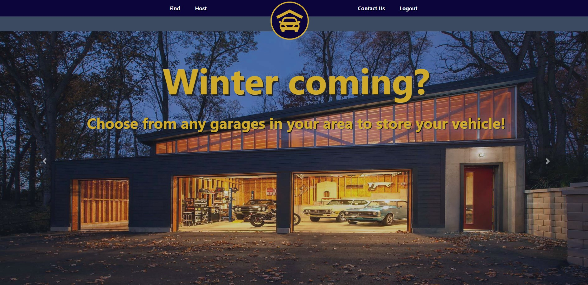
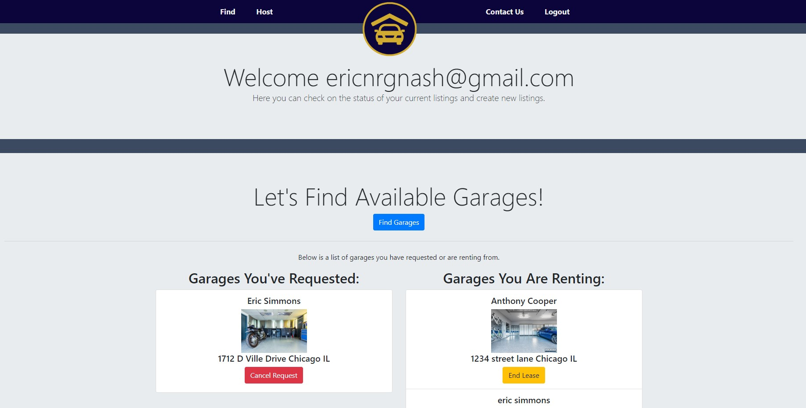
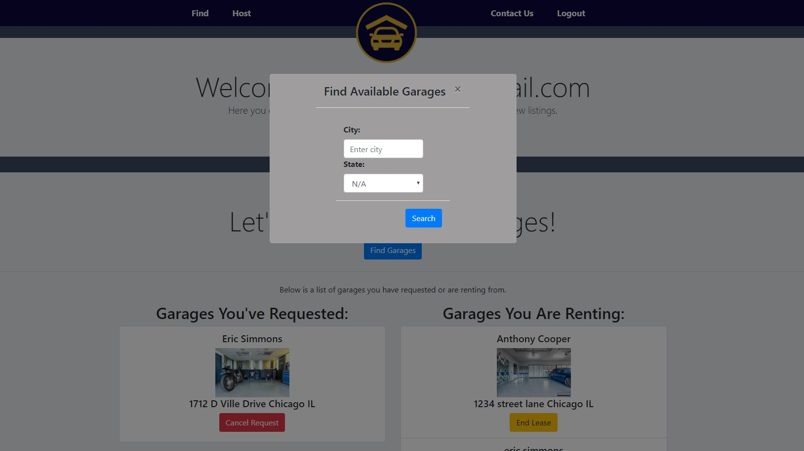
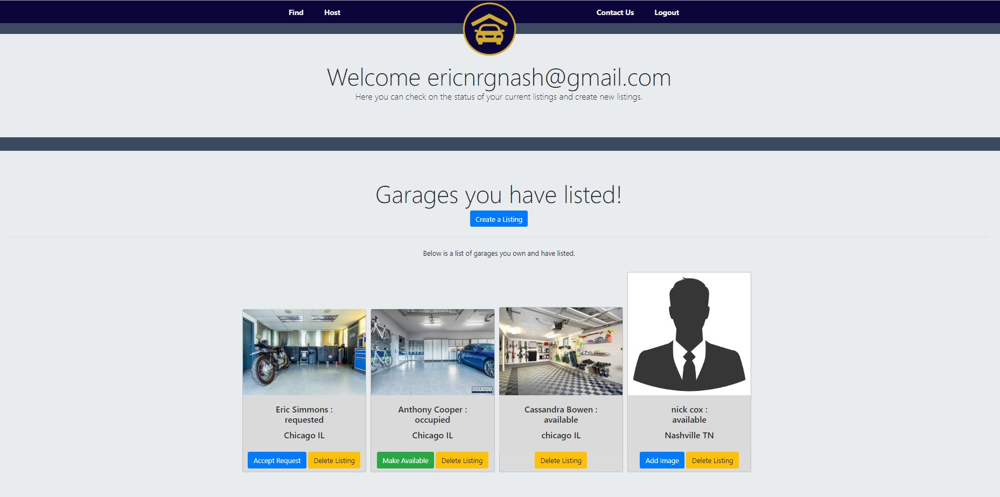
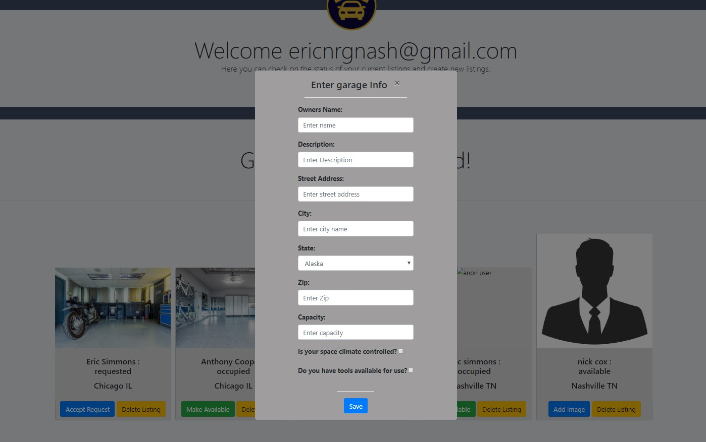

# Garaged

## Introduction
Garaged is a tool to connect host who have extra space in their garage to rent out to users looking to store their vehicles like motorcycles, cars, recreational vehicles in a space thats away from the elements. Host also have a choice to add an option for users to borrow tools to work on vehicles in the garages. 

Link to app: [Garaged](https://garaged-app.herokuapp.com/)

Link to Git Repository: https://github.com/EricEnergy/garaged

---

## User Info

In order to use the app for the first time, you need to sign up and create an account. To create an account you must enter a valid email address and a password (5 characters or longer) in the sign up page. You can use your own email or use this email and password below.
- Email: tester@testing.com
- Password: Testing123

---

## How this Works

- The login screen you will need to login in to have access to this website. If you do not have an account already, you can create one very easliy. 

- Now that you have logged into our app the fun can begin! Go ahead and click on the find button in the navigation bar at the top. 

- Welcome to the finders page. Here you will be able to find a garage thta is availible for rent, see any you currently have a pending request for, and see any garages you are currently renting from. With any request you have pending, you can cancel the request or with any garages you are renting you can end your lease.

- Here in the finders page you can also see that you can look for availible garages for rent by typing in your city and state. Go ahead and try Chicago IL, or Nashville TN.

- Now that we have explored how to locate garage space that are up for grabs, lets check out how to host your own space. Click on the "Host" tab in the nav bar.

-  Here you can see in our snapshot the first listing has been requested, and is now ready for the host to accept. The second listing is currently occupied, and the host has the option to make it available or delete the listing. The third listing is currently up for grabs, and the forth listing is also up for grabs, but the host has not added an image of the garage space for rent which they can now do. 

-  After Clicking on the "create a listing" button, this is where you will create the listing for your space. The process to create a new listing is strightforward and easy for all users. 

## Technologies
- Node
    - Express
    - Express Handlebars
    - Sequelize
    - Passport
    - BCrypt
- CSS
    - Bootstrap
- API
    - Cloudinary
- GitHub
    - Version Control
- Libraries
    - jQuery
- Testing
    - Postman
    - Chai
    - Jest
- Deployment
    - Heroku

---

## Planned Features

- Functionality to add user profile photos
- Feature to submit contact requests
- Payment platform
- User Ratings
- Ability to edit unit info
- Functionality to search by zip code and radius

---

## Authors
- Eric Simmons
- Nick Cox
- Zac Talley
- Mario Cortes

---

## Collaborators and Acknowledgements
To:
- Anthony Cooper
- Jed Kendall
- Sasha Peters
- Our fellow classmates
- And everyone else who assisted us throughout this project and in one way or another saved us from banging our heads against a wall...

**Thank You!**

---
